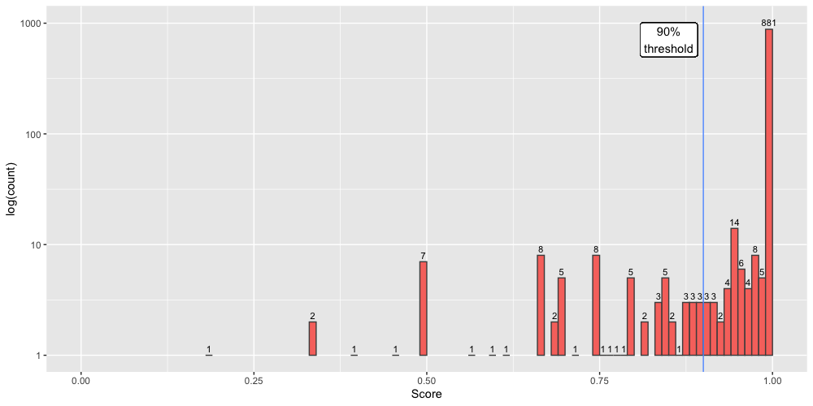
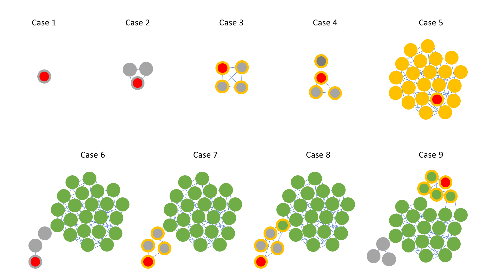

# COPLA, a taxonomic classifier of plasmids

## How to install COPLA

### Dependencies

COPLA is a pipeline of scripts programmed with ```bash```, ```python```, ```perl```, and ```ruby```. In addition to the respective runtimes, COPLA requires several third-party programs and Python libraries to function. The following list details the specific versions used during the development of COPLA:

- BLAST+ 2.9.0
- Prodigal v2.6.3
- HMMER v3.3
- PlasmidFinder 2.1
- MacSyFinder 1.0.5
- graph-tool 2.33
- GNU Parallel 20161222
- ani.rb (downloaded on Mar 16, 2017 from https://github.com/lmrodriguezr/enveomics)

### Installation

First we need to download the scripts and databases used by COPLA from GitHub:

~~~bash
# Change PROJECT_ROOT_DIRECTORY value to suit your preferences
PROJECT_ROOT_DIRECTORY=copla
git clone https://github.com/santirdnd/COPLA ${PROJECT_ROOT_DIRECTORY}
cd ${PROJECT_ROOT_DIRECTORY}
~~~

A conda environment has been provided as a convenient way to install most of the COPLA dependencies. Just run the following command:

~~~bash
conda env create -f copla.environment.yml -n copla
~~~

Alternatively, run this other command if you want to use the exact environment used during COPLA development:

~~~bash
conda create --file copla.spec-file.txt -n copla
~~~

MacSyFinder, the program used for MPF typing, is a bit trickier to install as it is a Python2 program and multiple versions of Python can't be mixed in the same conda environment. A specific conda environment is used to facilitate its installation. Run the following commands to install MacSyFinder:

~~~bash
conda env create -f macsyfinder.environment.yml -n macsyfinder
conda activate macsyfinder
cd ${CONDA_PREFIX}
wget https://github.com/gem-pasteur/macsyfinder/archive/macsyfinder-1.0.5.tar.gz
tar zxf macsyfinder-1.0.5.tar.gz
wget https://github.com/gem-pasteur/macsyview/archive/macsyview-1.0.1.tar.gz
tar zxf macsyview-1.0.1.tar.gz
mv macsyfinder-macsyfinder-1.0.5 src
mv macsyview-macsyview-1.0.1 src/macsyview
cd src
python setup.py build
python setup.py test -vv
python setup.py install --prefix=${CONDA_PREFIX}
conda deactivate
cd ${PROJECT_ROOT_DIRECTORY}
~~~

Finally, we need to download the software for ANI calculation. We will use ```ani.rb```, a Ruby script provided in the Enveomics Collection:

~~~bash
wget https://github.com/lmrodriguezr/enveomics/raw/master/Scripts/ani.rb
chmod +x ani.rb
mv ani.rb bin/
~~~ 

Once we have all the necessary software, we need to download the databases that COPLA uses. For this reason, the ```download_Copla_databases.sh``` script has been provided, which additionally generates the ```CoplaDB.fofn``` file in the ```databases/Copla_RS84``` directory. At the end of the command execution, this file should contain a list with the absolute paths to the Fasta sequences that make up the database. Just be sure to adapt the contents of the ```copla.ini``` configuration file to your local installation so that ```CoplaDB.fofn``` is generated automatically:

~~~bash
bin/download_Copla_databases.sh
head databases/Copla_RS84/CoplaDB.fofn
~~~

A last script, ```post_install_test.sh```, has been developed to verify the correct installation and operation of COPLA. If warning or error messages appear for any of the tests performed, it will be an indication that parts of the COPLA installation should be checked. Anyway, a success message in the last two tests would indicate that COPLA may well be installed correctly.

~~~bash
bin/post_install_test.sh
~~~

Other relevant infomation:

- The MOBscan relaxase database was downloaded from [https://castillo.dicom.unican.es/mobscan_about](https://castillo.dicom.unican.es/mobscan_about)
- CONJScan, the database for MPF typing used by MacSyFinder, was downloaded on 2019-05-30 from [https://github.com/gem-pasteur/Macsyfinder_models](https://github.com/gem-pasteur/Macsyfinder_models) and updated using the relaxase HMM profiles from MOBscan
- The PlasmidFinder replicon database was downloaded on 2019-07-31 from [https://bitbucket.org/genomicepidemiology/plasmidfinder_db.git](https://bitbucket.org/genomicepidemiology/plasmidfinder_db.git)
- The Comprehensive Antibiotic Resistance Database (CARD) database was downloaded on 2020-10-15 from [https://card.mcmaster.ca/download](https://card.mcmaster.ca/download)

## Using COPLA

COPLA can be used to predict the PTU to which a plasmid belongs. For this just its nucleotide sequence is needed:

~~~bash
bin/copla.py test/NZ_CP028167.1.fna \
    databases/Copla_RS84/RS84f_sHSBM.pickle \
    databases/Copla_RS84/CoplaDB.fofn \
    test/NZ_CP028167.1_output
~~~

Draft plasmids are supported by COPLA automatically executing a simple concatenation of their contigs.

If the plasmid ORFeome is uploaded by the user, it will be used by COPLA (option `-a`) to obtain a type MOB and MPF according to the user specifications.

Indicating the query topology (option `-t`, linear or circular) is recommended for more accurate MPF typing. If not provided, COPLA uses a circular topology by default. Multifasta input sequences are always processed using a linear topology. For further details see Abby _et al._ [PMID: 26979785](https://pubmed.ncbi.nlm.nih.gov/26979785/).

Finally, if the user provides the taxonomic data asociated with the plasmid host (options `-k`, `-p`, `-c`, `-o`, `-f`, `-g`, and `-s`), COPLA will warn the user about changes in the host range of the query's assigned PTU.

The following command shows a complete example of the use of COPLA:

~~~bash
bin/copla.py test/NZ_CP028329.1.fna \
    databases/Copla_RS84/RS84f_sHSBM.pickle \
    databases/Copla_RS84/CoplaDB.fofn \
    test/NZ_CP028329.1.fna_output \
    -a test/NZ_CP028329.1.faa \
    -t circular \
    -k Bacteria \
    -p Firmicutes \
    -c Bacilli \
    -o Lactobacillales \
    -f Lactobacillaceae \
    -g Lactobacillus \
    -s 'Lactobacillus sp. D1501'
~~~

## How COPLA works

Just as sHSBM, COPLA infers the PTU membership from the similarity relationships between plasmids in the database. After calculating the ANI percentage identity between the query and the reference plasmid set, COPLA inserts the query into the reference network and performs an statistical search for similar plasmids. Finally, the query is assigned to a known PTU, or to a new PTU (labeled as PTU-?) if the algorithm find clues pointing to that outcome. PTUs will not be named for clusters with fewer than 4 members. For the user to evaluate the COPLA PTU assignation of a query plasmid, a score is provided based on the overlap of the graph partitions before and after the query was inserted into the reference network (for additional details see troubleshooting bellow).

## COPLA output

COPLA output consists of five different files:

- __query.ptu_prediction.tsv__: File providing the predicted PTU of the query, the graded PTU host range (updated by the taxonomic info of the query if provided by the user), the prediction score, and additional information (see troubleshooting) to help interpret the output.
- __query.related_plasmids.tsv__: List of reference plasmids used for the calculation of the prediction score.
- __query.ani.tsv__: List of ANI percentage identities between the query and reference plasmids. Only plasmids with a detected homology spanning >50% of the shorter genome are reported (Best reciprocal BLASTn hits of 1,000 bp genome fragments with >70% idendity over >70% length. Fragments are obtained using a sliding window algorithm with 200 bp steps). File columns indicate query, reference accession number, ANI, standard deviation of ANI, fragments used for the calculation of ANI and fragments of the reference genome.
- __query.qry_info.tsv__: Other relevant plasmid information: genome length, MOB typing (according to MOBscan), MPF typing (according to CONJScan but with the relaxase HMM profiles updated to those of MOBscan database), replicon typing (based on PlasmidFinder using 80% identity threshold) and AMR genes (based on a BLASTn search against the CARD database)
- __query.faa__: If not provided by the user, this file is the plasmid ORFeome calculated by Prodigal. Prodigal autolearning mode is used for plasmids >100 Kb, smaller plasmids are calculated using Prodigal meta mode.

### Troubleshooting: Predicted outcome types

COPLA predictions can result in three different outcomes for PTU membership of the query plasmid. A query could be a member of: (i) a known PTU, (ii) a putative new PTU (provisionally named as "PTU-?"), or (iii) the plasmid remains unclassified (displayed as "-"). The quality of these predictions can be further evaluated with the help of the score output. To assess COPLA performance, we sampled 1,000 RefSeq200 plasmids not present in the reference database (RefSeq84). As shown in Figure 1, results indicate that ~88% of all queries (spanning all three classes) the prediction score a >99%, with the remaining predictions scoring lower values as shown in the figure.



___Figure 1.___ _Score distribution for 1,000 plasmids sampled from RefSeq200, not present in the COPLA reference database (RefSeq84). The figure displays a semilogarithmic plot of the number of plasmids containing each given score._

To validate the PTU assignment, a score of 90% is recommended. This threshold means that, for a 10-member PTU, the AI has conficting data for clustering 1 of them. As an example, the problematic plasmid could be a cointegrate of plasmids belonging to two different PTUs. Assuming the 90% score threshold, COPLA confidently assigned 93% of the 1,000 samples.

To help understand the different results that COPLA provides, Figure 2 shows several representative schematics.



___Figure 2.___ _Representative prediction outcomes. The query plasmid is represented by the node with the red inner circle. For all other nodes, the color of the inner circle represents the PTU assigned in the reference database (i.e. using only RefSeq84 plasmids). The outer rings represent the PTU assigned by COPLA. Yellow represent the PTU assigned to the query, green is a different PTU, and grey colors represent not assigned PTUs._

When the query is part of a small graph component (4 members or less) the PTU prediction is pretty much trivial (cases 1 to 4):

- Case 1 shows a query represented by a singleton, with no ANI relatioships to any reference plasmids, a not uncommon event (355 out of 1,000 samples). In this case, COPLA output includes the sentence: _PTU could not be assigned. Query is part of a graph component of size 1_.

- Case 2 represents a putative PTU, consisting on a set of plasmids unrelated to all other plasmids in the dataset. It is left unnamed as it does not reach the 4-member threshold. In this case (70 out of 1,000 samples) COPLA output includes the sentence: _PTU could not be assigned. Query is part of a graph component of size 2|3_.

- Cases 3 and 4 represent the finding of a new (putative) PTU, by clustering the query with 3 reference plasmids. These reference plasmids could all belong to the same cluster (case 3) or not (with the query acting as an attractor of different plasmids as shown by case 4). These cases (17 out of 1,000 samples) are highlighted in COPLA output by including the sentence: _New (putative) PTU. Query is part of a graph component of size 4_.

In cases 5 to 7 the query is part of a larger graph component (>4 members), that is, a known PTU. In these cases, the assignation of the query is straightforward. These cases represent the predominant scenarios in which no significant differences in graph partitioning were detected.

- In case 5 we have (i) queries for which a PTU can be unequivocally assigned and score is 100% (308 out of 1,000 samples), and (ii) cases in which the score is fewer than 100% (58 out of 1,000 samples with score >=90% and 46 samples with score <90%). COPLA output includes the sentence: _Query is a PTU-xxx plasmid_.
- Case 6 shows a scenario in which no PTU was assigned because of the 4-member threshold. This case (113 out of 1,000 samples) is highlighted in COPLA output by including the sentence: _PTU could not be assigned. Query is part of a sHSBM cluster of size 1|2|3_.
- The finding of a new (putative) PTU is shown in case 7. In this case (8 out of 1,000 samples) COPLA output includes the sentence: _New (putative) PTU. Query is part of a sHSBM cluster of size >=4_.

Cases 8 and 9 represent scenarios where the inclusion of the query leads to a different partition in the connected component to which the query belongs. Case 8 highlights the case of plasmids (such as cointegrate plasmids) for which the algorithm can not decide unambigously to which PTU should assign the query. Case 9 showcases situations of loosely defined PTUs (showing low intragroup density, such as PTU-FE see ref. [1]). The score provided by COPLA is key to detect and to assess the level of confidence of the PTU prediction.

- If the new cluster had fewer than 4 members no PTU is assigned. This case (4 out of 1,000 samples with a score >=90% and 5 with a score <90%) is highlighted in COPLA output by including the sentence: _PTU could not be assigned. Query is part of a sHSBM cluster of size 1|2|3_.
- If the cluster could not be assimilated to a previously known PTU, a new (putative) PTU is defined. In this case (16 out of 1,000 samples, all with score lower than 90%) COPLA output includes the sentence: _New (putative) PTU. Query is part of a sHSBM cluster of size >=4_.

## References

If you find COPLA useful, please cite the following papers:

- PTU concept and graded plasmid host range definition:

	[1] Redondo-Salvo, S., Fernández-López, R., Ruiz, R., Vielva, L., de Toro, M., Rocha, E.P.C., Garcillán-Barcia, M.P., de la Cruz, F. “Pathways for Horizontal Gene Transfer in Bacteria Revealed by a Global Map of Their Plasmids.” *Nat Commun* **11**, 3602 (2020). https://doi.org/10.1038/s41467-020-17278-2

- Description of the COPLA algorithm:

	[2] Redondo-Salvo, S., Bartomeus, R., Vielva, L., Tagg, K.A., Webb, H.E., Fernández-López, R., de la Cruz, F. “COPLA, a taxonomic classifier of plasmids.” (2020).
